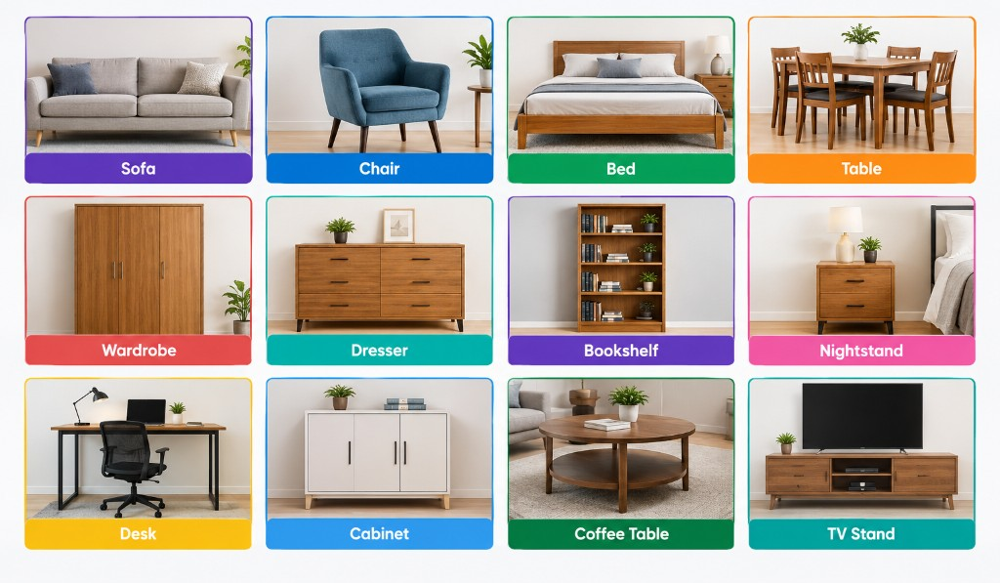
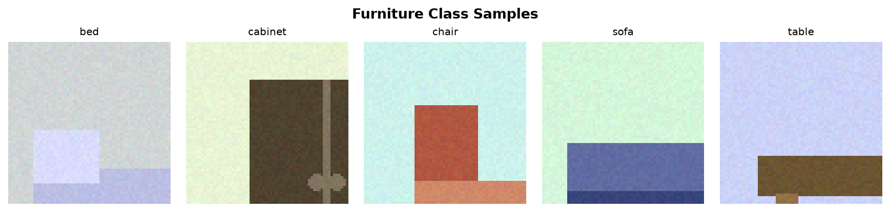
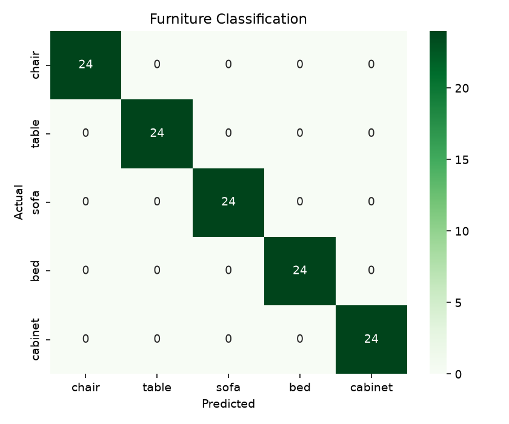

# Furniture Classification ML

Classical ML image classifier for furniture categories:

`chair` · `table` · `sofa` · `bed` · `cabinet`

## Approach
1. Generate synthetic class-styled images (or replace with real photos)
2. Extract pixel + color-histogram features
3. PCA dimensionality reduction
4. RBF SVM classifier with probability estimates

## Setup
```bash
cd furniture-classification-ml
python -m venv .venv
.venv\Scripts\activate
pip install -r requirements.txt
```

## Run
```bash
python generate_data.py
python train.py
streamlit run app.py
```

## Swap in real data
Place images in:
```
data/images/<class_name>/*.jpg
```
Then re-run `train.py`.

## Sample Outputs



